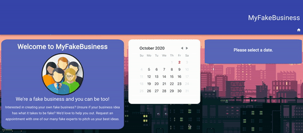

# Appointment App - MERN

## Live Web App
Click [here](http://myfakebusiness.us-east-2.elasticbeanstalk.com/) to view the project deployed on AWS Elastic Beanstalk.

## Technologies
* React
* React Router
* MongoDB Atlass
* Express
* Node
* Sendgrid
* Material UI

## Node Packages
* React-Day-Picker
* React-Router-Modal
* React-Hook-Form

## Description

A CRUD app built using the MERN stack. A user can create, read, update and delete a request for an appointment with 'MyFakeBusiness.com'. An email is sent to the user confirming a request for an appointment has been submitted.

## Reflection
Building the project itself was relatively straightforward. This was my first experience working with MongoDB and Material UI so there was a bit of a learning curve there, particularly around getting data to and from the modals (pop-ups) as well as styling because not all the necessary information was exposed as they were created from a node package. In the future, I will likely create my own modals to avoid this. 

The biggest challenge was deploying to Elastic Beanstalk as it required a reorganization of the file structure that I was used to when deploying to Heroku. I found a single Medium article on how to deploy to AWS with a React and Node app (with no database), so there was a lot of experimentation to get it right. This was made even more challenging as the file structure necessary to deploy to Elastic Beanstalk makes it difficult to run the project on a local machine for things like debugging. This process also requires configuring a web pack and gulp file, something I had no previous experience with. 

## Next Steps
* Add user login
* Testing
* Custom Material UI theme
